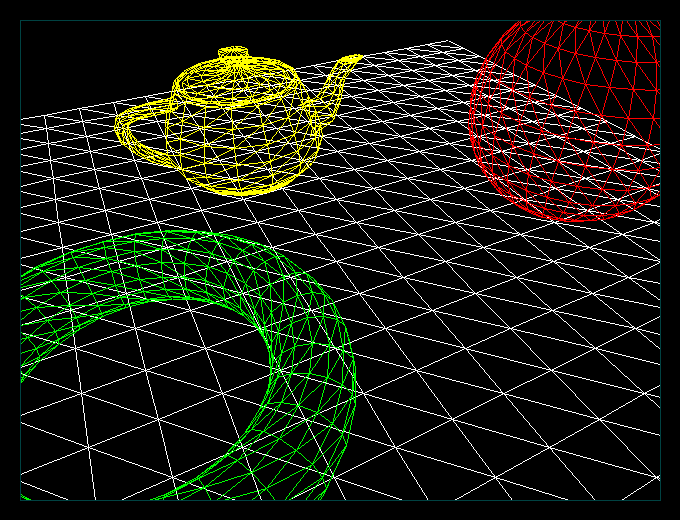



## Wireframe 3D, Pure VB

### Description

Wireframe3D fully in VB, you can move the player position, view the scene anywhere..... (see screenshot)
 
### More Info
 

             |
---                |---
**Submitted On**   |2005-03-24 01:50:16
**By**             |[KACI  Lounes](https://github.com/Planet-Source-Code/PSCIndex/blob/master/ByAuthor/kaci-lounes.md)
**Level**          |Intermediate
**User Rating**    |4.8 (24 globes from 5 users)
**Compatibility**  |VB 4\.0 \(32\-bit\), VB 5\.0, VB 6\.0
**Category**       |[Graphics](https://github.com/Planet-Source-Code/PSCIndex/blob/master/ByCategory/graphics__1-46.md)
**World**          |[Visual Basic](https://github.com/Planet-Source-Code/PSCIndex/blob/master/ByWorld/visual-basic.md)
**Archive File**   |[Wireframe\_1868133252005\.zip](https://github.com/Planet-Source-Code/kaci-lounes-wireframe-3d-pure-vb__1-59642/archive/master.zip)

